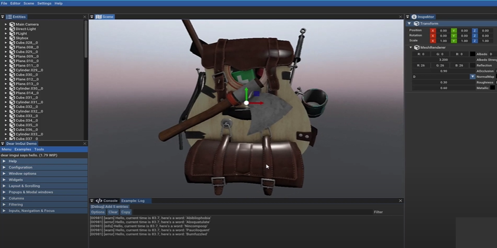

<p align="left">
  
</p>
<p align="left">
  
</p>
Fractal Engine its 3D Game Engine

Not Finished yet

Features:
* GUI
* Entity Component System
* Loading 3D models
* Errors System
* Component (Transform3D)
* Component (Camera)
* Component (Material)
* Component (Light)

Features to do:

* Launcher
* Particle System
* Bulid for Linux,Windows,Android,OSX
* C# and Lua Support
* 2D version
* Loading and Crating Projects System
# Bulid

To bulid you need :

* GLM
* SFML
* Glew
* GLFW
* ASSIMP

and C++ compiler

To install this libaries on Ubuntu/Debian type
```sh
$ sh lib.sh
```
