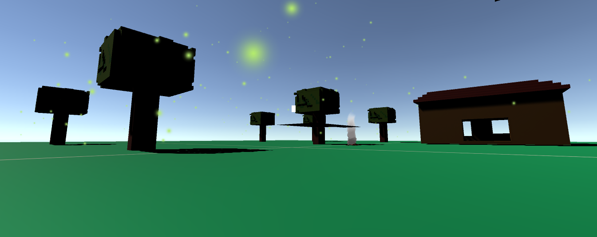

<p align="left">
  
</p>
Fractal Engine its 3D Game Engine

Not Finished yet

Features:
* GUI
* ECS(Entity Component System)
* Loading 3D models
* Errors System
* Component (Transform3D)
* Component (Camera)
* Component (Material)
* Component (Light)
* C# mono scripting

Features to do:

* Launcher
* Particle System
* Bulid for Linux,Windows,Android,OSX
* Lua Support
* 2D version
* Loading and Crating Projects System

# ShowCase

<p align="left">
  
</p>

# Exemple C# script

```cpp
using Fractal;
using System;

public class CamSpinSpin : FractalScript
{
    public float Speed;
    
    public void Start()
    {
        Speed = 10;
    }

    public void Update(float deltatime, ref Transform transform)
    {
        transform.Rotation.Y += Speed * deltatime;
        transform.Rotation.X += Speed * deltatime;
    }
}
```

# Bulid

To bulid you need :

* GLM
* SFML
* Glew
* GLFW
* ASSIMP

and C++ compiler

To install this libaries on Ubuntu/Debian type
```sh
$ sh lib/lib.sh
```
