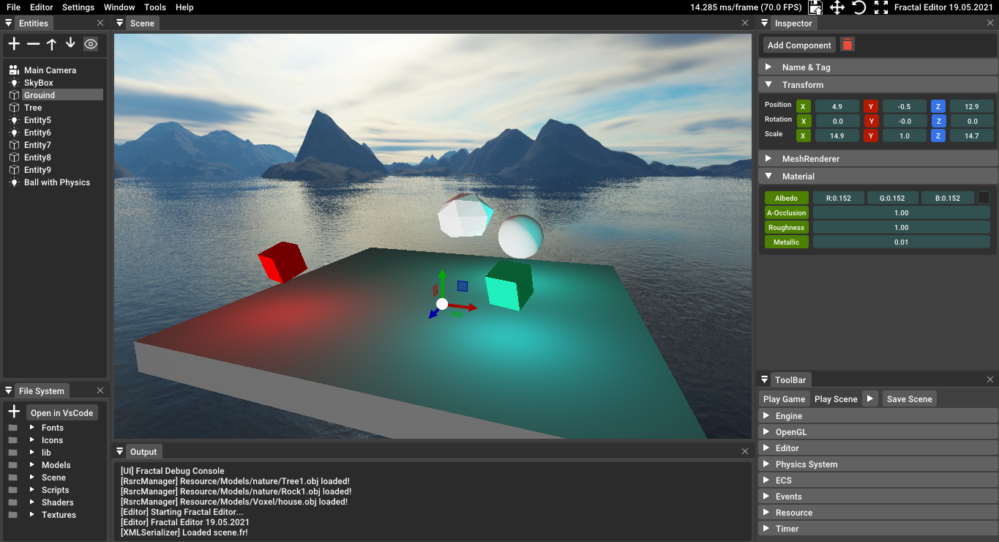

  

Fractal Engine is a Cool 3D game engine

  
Features:
* ImGui Editor
* Loading 3D models with ASSIMP
* Loading 2D textures with stbimage
* Fully Featured ECS(Entity-Component-System)
* Scene System (XML)
* Light System
* Gizmos

Features to do:

* Collision system
* Physics Engine
* Custom Scripting Language (FR Script)
* Python or Lua Scripting
* Better Linux and Mac Support
* Code Cleanup
* Custom UI library

  
Discord Server! : https://discord.gg/aXHjdQfCMK
# Screen Shot

  

# Building

### Dependencies

* GLM https://github.com/g-truc/glm
* GLEW https://github.com/nigels-com/glew
* GLFW https://github.com/glfw/glfw
* ASSIMP https://github.com/assimp/assimp
* TinyXML https://github.com/leethomason/tinyxml2
* ImGui https://github.com/ocornut/imgui
* stb https://github.com/nothings/stb
* ImGuizmo https://github.com/CedricGuillemet/ImGuizmo
* Scons https://github.com/SCons/scons

#### Installing these libraries on Linux

* Debian/Ubuntu
` $ sudo apt install -y libglm-dev libglew-dev libglfw3-dev libassimp-dev assimp-utils libxmu-dev libxi-dev libtinyxml-dev `
* Fedora
` $ sudo dnf install glew-devel glm-devel assimp-devel glfw-devel tinyxml2-devel `

## Setup
* First you need to Clone Repo ` $ git clone https://github.com/kacperks/Fractal_Engine.git `
* Then you need to install scons ` $ pip install scons `
* Go to the directory of the Fractal engine and type ` $ scons `

# Developers

* <a href = "https://github.com/kacperks"> kacperks </a>
* <a href = "https://github.com/lubek-dc"> lubek-dc </a>
* <a href = "https://github.com/BoomerDev"> BoomerDev </a>

# Contributors    

* <a href = "https://github.com/Yavuz1234567890"> Yavuz1234567890 </a>
* <a href = "https://github.com/honeystudios"> honeystudios </a>
